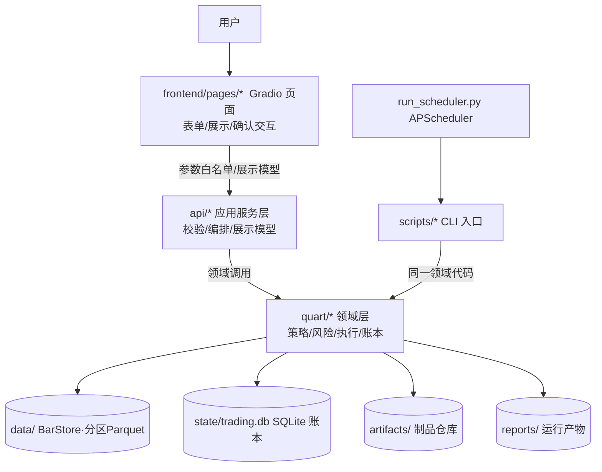
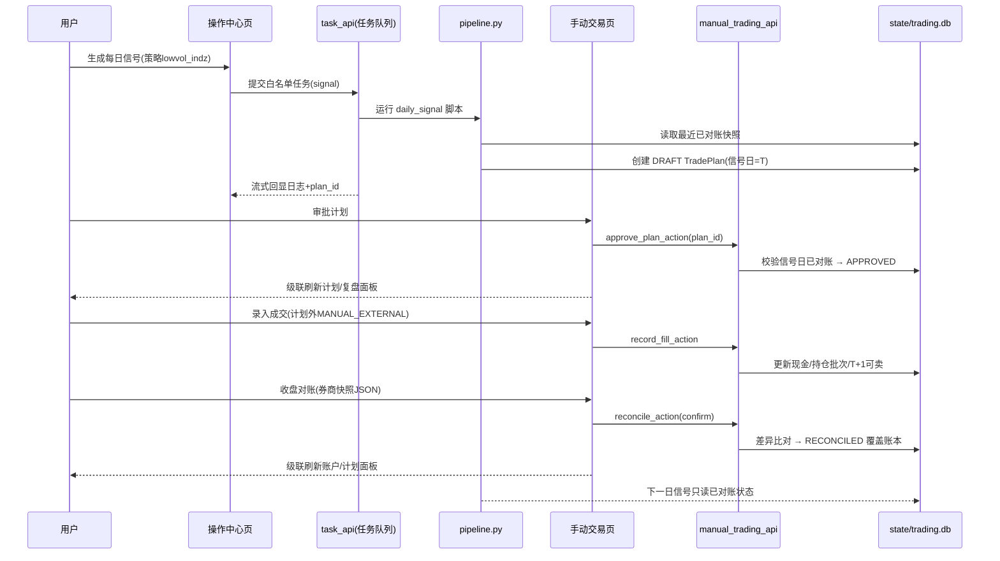

# Quart 当前态前后端交互架构（As-Is，2026-08-31）

> 本文只描述当前工作树及已知缺口，不代表目标架构已经完成。目标边界、运行拓扑和迁移阶段见 [`docs/TARGET_ARCHITECTURE_V3.md`](docs/TARGET_ARCHITECTURE_V3.md)，任务拆分与质量门禁见 [`docs/DEVELOPMENT_COORDINATION.md`](docs/DEVELOPMENT_COORDINATION.md)。
>
> 已知偏差：部分页面仍直接读取 `reports/`、`BarStore` 或配置；当前任务队列和刷新总线仍依赖进程内状态。新增代码必须遵守分层约束，存量偏差按 `UI-001`、`ARCH-001` 和 `ARCH-002` 收敛。

## 1. 分层架构

**目标依赖约束（新增代码必须遵守，存量偏差按计划迁移）**：

| 层级 | 允许 | 禁止 |
|---|---|---|
| `frontend/pages` | 调用 api 层函数、组件渲染 | 直接读写 SQLite、拼接 shell 命令、直读领域数据 |
| `api/` | 输入校验、DataFrame/Markdown 展示模型、任务编排 | 放置策略计算、账本 SQL |
| `quart/` | 策略/风险/执行/账户领域逻辑 | 依赖 Gradio |
| `scripts/` | 自动化 CLI，与前端共用领域代码 | 成为唯一操作入口 |

## 2. 数据流：一条 T+1 交易指令的生命周期

## 3. 页面 → API → 领域服务映射

| 前端页面 | API 服务 | 领域层 | 状态 |
|---|---|---|---|
| 🏠 首页 | backtest_api / research_api / strategy_api | backtest.metrics | ✅ 真实数据 |
| 🗃️ 数据总览 | data_api | data.store(BarStore) | ✅ 真实数据（本轮修复分区路径） |
| 🧰 操作中心 | task_api（白名单任务） | pipeline / scripts | ✅ 真实 |
| 🔬 因子研究 | research_api + 页面直读 reports | research/factors | ✅ 真实优先，缺失回退提示 |
| 📈 回测中心 | backtest_api / task_api / artifacts_api | backtest.engine / walkforward | ✅ 真实 |
| 📋 每日信号 | 页面直读 reports/signal_*.md | pipeline | ✅ 真实 |
| 💼 手动交易 | manual_trading_api | manual_trading（SQLite 账本） | ✅ 真实 |
| 📡 策略监控 | task_api / strategy_api / manual_trading_api | strategy / task_queue | ✅ 真实 |
| 🧩 归因分析 | 页面直读 reports + BarStore | backtest | ✅ 真实（本轮去除随机占位） |
| 🛡️ 风险管理 | manual_trading_api + BarStore | risk | ✅ 真实（本轮修复分区路径） |
| 🌿 因子生态 | 页面直读 reports | research | ✅ 真实优先（本轮去除假 IC） |
| 🔍 回测诊断 | 页面直读 reports/wfa_*.csv | backtest.walkforward | ✅ 真实 WFA（本轮去除假数据） |
| 📖 参数词典 | quart.config + strategy | config_schema | ✅ 动态注入（本轮去除硬编码） |

## 4. 关键不变量（架构层面）

1. **单一数据源**：策略清单 = `REGISTRY`（前端零维护）；账户状态 = SQLite 账本（不再读 holdings.json）；参数 = `resolve_params` 优先级 显式 > overrides > 全局
2. **无未来函数**：T 日收盘决策 → T+1 开盘撮合；`MarketData.slice_by_pos` 隔离历史窗口
3. **回测=实盘同一执行路径**：`order_generator.generate_orders` 唯一实现，执行差异只来自注入的 ExecutionModel
4. **账户变化唯一通道**：真实成交 + 确认后的券商快照；计划本身不改变账户
5. **成本诚实**：卖出滑点不利方向（1-slip）、双边费用、几何成本口径
6. **A 股配色**：全平台红涨绿跌

## 5. 本轮回修的架构问题（2026-08-31）

| # | 问题 | 级别 | 修复 |
|---|---|---|---|
| 1 | `api/data_api` 直读旧 per-symbol 布局，分区迁移后股票数=0、个股数据全空 | P0 | 改走 `BarStore`（双布局兼容），`index_count` 兼容 `year=*` |
| 2 | `api/backtest_api.get_cost_breakdown` 滑点归因读旧路径，成本明细静默失败 | P0 | 改走 `BarStore` |
| 3 | 归因页因子暴露为 `np.random` 占位 + DEMO_BANNER | P0 | 改为真实持仓行情计算（动量/波动/规模），缺数据源因子标注 N/A |
| 4 | 回测诊断页硬编码假 WFA 数据，与回测中心真实面板并存 | P0 | 重写为读真实 `reports/wfa_*.csv`，无数据显示运行指引 |
| 5 | 因子生态页硬编码假 IC/拥挤度 | P1 | 改为真实 factor_research 输出，拥挤度标注规划中 |
| 6 | 首页指标卡涨绿跌红（美股习惯） | P1 | 改红涨绿跌（A 股习惯） |
| 7 | 参数词典硬编码当前值（与 config 漂移） | P1 | 从 config + build_strategy 动态注入 |
| 8 | 每日信号页/归因页硬编码 `reports/` 相对路径 | P1 | 改 `common.reports_dir()/universe_dir()` |
| 9 | 手动交易页操作后面板不刷新（上一轮已修） | P0 | 事件依赖级联刷新 |
| 10 | 风险/监控页旧路径读取（上一轮已修） | P0 | 统一 BarStore |

## 6. 仍待实现（按规划）

- P0：持久化任务表、claim/lease/fencing 与进程重启恢复，替换进程内任务状态；
- P0：统一 OMS/订单账本、幂等键、合法状态迁移与成交入账事务；
- P0：`SecurityMaster` / `RuleBook`，统一 ST、板块、涨跌停、停复牌、上市日和手数规则；
- P0：独立组合约束与常驻风控状态机，在计划审批和订单提交前强制执行；
- P0：前端统一走版本化应用服务，消除页面对 `reports/`、`BarStore`、配置和账本的直读；
- 阶段 F：**具体券商 SDK 接入**（BrokerAdapter 契约 / PaperBroker 状态机 / `sync_broker_fills`
  回报统一入账 / 前端模拟执行入口均已完成，2026-08-31；真实券商需权限与联调环境）
- 因子生态：拥挤度（截面离散度）、失效预警（滚动 IC 时序）——需因子研究管线输出
- 归因页：价值/反转/流动性暴露需 Barra 类风格因子数据源

完整优先级、依赖和验收标准见 [`docs/DEVELOPMENT_COORDINATION.md`](docs/DEVELOPMENT_COORDINATION.md)；长期商业化能力边界见 [`QUANT_PLATFORM_REFACTOR_ROADMAP.md`](QUANT_PLATFORM_REFACTOR_ROADMAP.md)。
