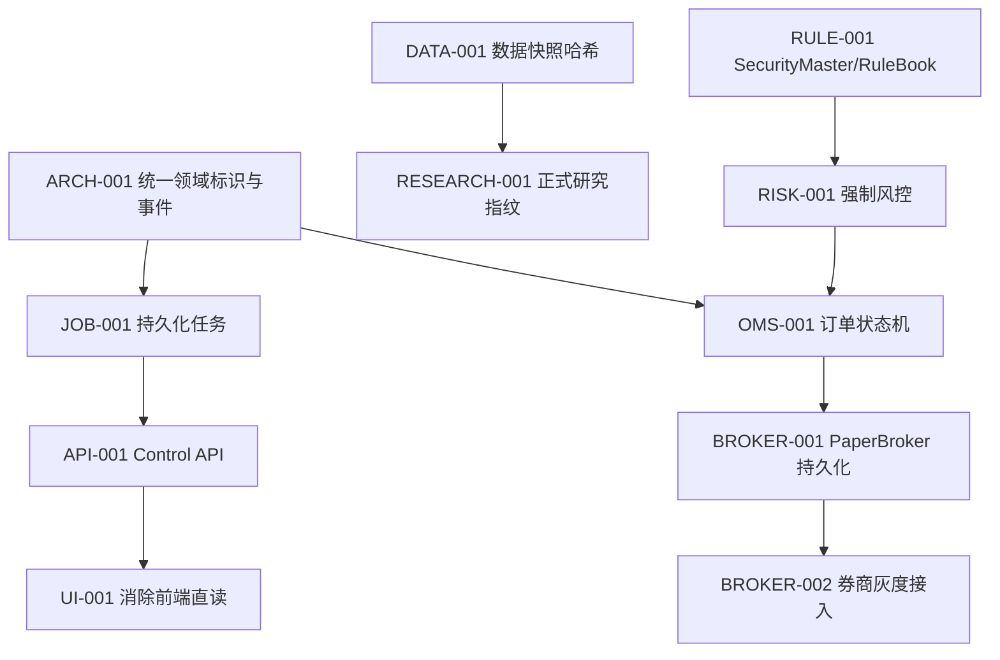

# Quart 开发协调流程

> 目标：让数据、研究、交易、前端和平台工作可以并行推进，同时避免多人或多个 AI Agent 修改同一状态源、重复实现领域逻辑或把未验证策略直接推入正式信号。

## 1. 工作流划分

| 工作流 | 主要目录 | 负责人角色 | 主要输出 |
|---|---|---|---|
| A 架构与领域契约 | `quart/domain`、`docs/adr`、架构文档 | 架构负责人 | 领域模型、依赖规则、ADR |
| B 数据与 PIT | `quart/data`、`scripts/update_*` | 数据工程 | 快照、质量门禁、证券主数据 |
| C 因子与策略研究 | `quart/research`、`quart/strategy` | 量化研究 | 因子证据、WFA、准入建议 |
| D 组合、风险与交易 | `quart/portfolio`、`quart/risk`、`quart/execution`、`quart/broker` | 交易系统工程 | 组合约束、OMS、Broker Adapter |
| E API 与前端 | `api`、`frontend`、后续 `control_api` | 全栈工程 | API 合同、操作页面、状态展示 |
| F 平台与质量 | `quart/infrastructure`、`.github`、`tests` | 平台工程 | Job、迁移、CI、监控、发布 |

一个任务只能有一个主工作流；跨工作流依赖通过接口、ADR 或 schema 明确，不通过复制代码解决。

## 2. 依赖顺序



强制门槛：

- `BROKER-002` 不能早于 `RULE-001`、`RISK-001`、`OMS-001` 和 `BROKER-001`；
- 正式策略准入不能早于 PIT、成本压力和连续 OOS 验证；
- 前端不能先发明新的状态字段，必须等待 API/领域合同；
- 数据 schema 变化必须先定义兼容或迁移方案，再修改消费者。

## 3. 工作项模板

每个可开发任务必须包含：

```markdown
ID / 标题：
主工作流：
目标：
非目标：
当前证据或问题：
影响的不变量：
API / schema / 配置变化：
依赖项：
验收标准：
测试计划：
文档更新：
回滚或兼容方案：
```

量化研究任务额外包含：

- 数据快照和股票池口径；
- 标签与执行时点；
- 样本内/样本外切分；
- 成本、换手和容量假设；
- 多重检验和参数搜索空间；
- 是否申请改变正式准入或线上参数。

交易任务额外包含：

- 幂等键；
- 状态机转换；
- 外部副作用所有者；
- 超时、断线、重试和恢复；
- 重复回报、部分成交和对账；
- paper/live 环境隔离。

## 4. 何时必须写 ADR

以下变化必须先新增或更新 `docs/adr/`：

- 新增进程、数据库、队列或外部基础设施；
- 改变订单、成交、账户或风控的权威状态源；
- 引入新的跨域依赖或替换核心框架；
- 修改 API 兼容策略、数据 schema 版本策略；
- 允许 AI、调度器或第三方系统执行写操作；
- 选择难以在一个迭代内回滚的技术路线。

普通 bug 修复、局部性能优化和不改变合同的重构不需要 ADR。

## 5. 开发执行流程

### 5.1 开始前

1. 检查工作树，区分已有改动和本任务改动；
2. 阅读相关 `AGENTS.md`、目标架构、ADR 和领域测试；
3. 在规划中只保留一个 `in_progress` 工作项；
4. 确定主工作流、涉及目录和可能冲突的共享文件；
5. 若修改共享合同，先提交合同与测试，再让下游并行实现。

### 5.2 实现中

1. 优先修复根因，保持变更聚焦；
2. 先写最小领域接口和回归测试，再接前端或外部 Adapter；
3. 长任务、外部请求和券商调用必须有超时与结构化错误；
4. 不允许前端直接访问数据库或文件系统来绕过 API；
5. 不允许研究结果自动修改正式策略白名单；
6. 每完成一个可验证切片，同步规划状态和相关文档。

### 5.3 提交前

按风险从小到大验证：

```powershell
uv run ruff check <changed paths>
uv run pytest <targeted tests> -q
uv run pytest tests -q
uv run mypy quart
git diff --check
```

若全量检查存在与本任务无关的历史失败，必须记录失败命令、错误和确认不相关的依据，不能静默忽略。

## 6. Git 与变更组织

- 分支使用 `feat/<topic>`、`fix/<topic>`、`refactor/<topic>`、`docs/<topic>`；Codex 创建分支时使用 `codex/` 前缀；
- 提交消息使用 `feat:`、`fix:`、`refactor:`、`docs:`、`test:`、`chore:`；
- 一个提交只处理一个可说明的意图，schema 与对应迁移、代码和测试不得拆散；
- 不提交数据全集、券商导出、密钥、临时测试目录或本地数据库；
- 不使用 `git reset --hard`、覆盖他人改动或在未授权时推送；
- 策略参数变化与基础设施重构尽量分开提交，便于归因和回滚。

## 7. 并行开发协调

### 7.1 文件所有权

高冲突文件在同一时间只分配给一个工作项：

- `config/settings.yaml`；
- `quart/domain/*` 的公共模型；
- 数据库 schema/migration；
- `quart/execution/order_generator.py`；
- `api/task_api.py` 和未来 Control API 注册入口；
- `README.md`、架构文档和主规划状态表。

其他工作流通过新模块和稳定接口并行，避免多人同时扩张共享热点文件。

### 7.2 合同优先

跨工作流按以下顺序交付：

1. 领域对象或 OpenAPI/schema 草案；
2. 合同测试与兼容策略；
3. Provider/Repository/Adapter 实现；
4. Application Service；
5. API 与前端；
6. 集成测试和运行文档。

### 7.3 AI Agent 协作

- 每个 Agent 领取一个明确工作包，不同时修改同一高冲突文件；
- Agent 必须报告实际修改文件、测试结果和未完成依赖；
- 新 Agent 先读取当前工作树和规划，不根据旧会话假设状态；
- 生成策略代码只能进入研究目录和沙箱，不得直接进入 live allowlist；
- 需要外部数据、权限或券商环境时明确标记 blocked，不用假数据伪造完成状态。

## 8. PR 评审门槛

### 8.1 通用检查

- 变更是否遵循目标依赖方向；
- 是否出现第二个权威状态源；
- 是否记录幂等、超时、恢复和回滚行为；
- 是否有最小回归测试；
- API、配置、schema 和文档是否同步；
- 是否包含密钥、账户信息、个人数据或不可复现大文件。

### 8.2 交易安全检查

- paper/live 是否明确隔离；
- 所有订单是否经过统一规则和 Risk Engine；
- 网络超时是否可能导致重复发单；
- 重复成交回报是否会重复入账；
- 部分成交、撤单失败和断线恢复是否覆盖；
- 账户对账差异是否可见且不会被静默覆盖。

### 8.3 研究可信度检查

- 是否存在未来函数、幸存者偏差或披露时滞错误；
- 是否报告样本外、成本、换手、容量和回撤；
- 参数搜索是否做多重检验或保留独立验证段；
- 数据快照和代码版本是否可追溯；
- 负结果是否如实保留，是否错误推广到正式信号。

仓库 PR 模板见 `.github/PULL_REQUEST_TEMPLATE.md`。

## 9. 文档同步矩阵

| 变化 | 必须更新 |
|---|---|
| 新增或调整页面操作 | `README.md`、前端/API 映射 |
| 新增 API 或 DTO | OpenAPI、API 测试、目标架构相关章节 |
| 数据 schema/快照变化 | 数据文档、migration、Artifact 指纹说明 |
| 策略或因子逻辑变化 | 研究报告、参数说明、准入状态 |
| 订单/风控/账本变化 | ADR、状态机、交易测试、手动交易文档 |
| 新增 Worker/队列/数据库 | ADR、部署、监控、故障恢复文档 |
| 完成规划工作项 | 对应规划勾选、`CODEX_PROGRESS.md` |

## 10. 发布流程

### 10.1 Research Release

- 固定数据快照和代码提交；
- 运行因子审计、基线、WFA、成本和容量压力；
- 生成 Artifact 和研究报告；
- Admission Gate 给出研究/观察/候选/准入状态；
- 不自动改变生产配置。

### 10.2 Platform Release

- 全量测试、lint、类型检查和配置检查；
- migration 前向升级与回滚演练；
- Job/Worker 重启恢复测试；
- 更新操作手册和变更说明；
- 发布后检查数据新鲜度、任务、信号和账户状态。

### 10.3 Trading Release

- PaperBroker 连续运行和故障注入通过；
- 券商查询与对账先于报单开放；
- 实盘功能由服务端开关、账户白名单和人工确认共同控制；
- 小资金、单账户、单一订单类型灰度；
- 演练 Kill Switch、撤单、断线和恢复；
- 发布后逐笔核对订单、成交、费用、持仓和现金。

## 11. 当前执行顺序与并行泳道

### 11.1 总体关键路径

当前存在两条主要建设链，除汇合点外可以并行推进：

```text
控制面链：ARCH-001 → DB-001 → JOB-001 → API-001 → UI-001
交易面链：DATA-001 → RULE-001 → RISK-001 → OMS-001 → BROKER-001 → OBS-001 → BROKER-002
研究链：  DATA-001 → RESEARCH-001 → RESEARCH-002 → Admission Gate
```

`ARCH-001` 同时约束 OMS；`OMS-001` 和 `JOB-001` 在 `OBS-001` 汇合。真实券商接入位于所有 P0 合同、规则、风控和恢复能力之后，不允许为了联调提前绕过。

### 11.2 现在可以立即并行的工作

| 并行泳道 | 主责角色 | 现在执行 | 当前交付物 | 不能越过的边界 |
|---|---|---|---|---|
| A 架构合同 | 量化平台架构师 | `ARCH-001`：统一 ID、`OrderIntent`、`RiskDecision`、`ExecutionReport`、错误码和事件版本 | ADR、领域 DTO、状态机草案、合同测试骨架 | 合同冻结前不得让各模块自行定义订单字段 |
| B 数据底座 | 数据工程师 | `DATA-001`：内容哈希快照、数据修订识别、PIT 元数据；准备证券主数据来源映射 | snapshot manifest、质量规则、数据测试 | 正式研究结论必须等待可复现快照 |
| C 研究审计 | 量化研究员/数据分析 | 固化当前因子、标签、股票池、成本与 WFA 审计协议；在现有快照上生成临时基线 | 因子覆盖率、IC/稳定性、换手、容量、回撤基线 | DATA-001 完成前结果只能标记 provisional，不得调整 live allowlist |
| D 前端盘点 | 前端工程师/产品 | `UI-AUDIT-001`：列出页面直读、命令入口、状态字段和缺失操作；绘制 Job/Order/Risk 页面原型 | 页面/API 矩阵、交互稿、DTO 需求清单 | API 合同冻结前只做原型和 mock，不新增状态源 |
| E 平台准备 | 后端平台工程师 | 设计 migration/Job 表、claim/lease/fencing 测试夹具；只搭建不含未冻结领域字段的基础骨架 | migration 规范、并发测试场景、故障矩阵 | 领域列和事件 payload 等待 ARCH-001 |
| F 质量基线 | QA/交易运维 | 固化当前测试基线，建立 T+1、幂等、重启恢复、重复回报和对账验收清单 | 回归矩阵、故障注入清单、UAT 脚本 | 不用 mock 成功代替真实持久化和恢复验证 |

以上六条泳道可以同时启动。架构师负责尽快完成 A，不阻塞 B、C、D、F 的盘点与协议工作；后端 E 只能先完成通用框架，不能抢先固化订单 schema。

### 11.3 分批实施顺序

| 批次 | 必须先完成 | 可并行工作 | 后端工作 | 前端工作 | 数据/研究工作 | 架构师工作 | 出口门槛 |
|---|---|---|---|---|---|---|---|
| 0 合同冻结 | 无 | A/B/C/D/E/F 六泳道启动 | migration 与 Job 技术方案 | 页面直读盘点、原型、mock DTO | 快照实现；审计协议与临时基线 | 完成 ARCH-001、ADR、依赖和错误语义 | 领域合同 v1 与合同测试骨架通过评审 |
| 1 双底座 | 批次 0 | `DB-001 → JOB-001` 与 `DATA-001 → RULE-001` 两条链并行；研究和前端继续准备 | SQLite migration、WAL、Job claim/lease/cancel/recovery | API client/状态组件按冻结 DTO 开发，不连接旧文件路径 | 内容哈希快照、SecurityMaster、RuleBook；研究等待正式快照 | 审核 schema 版本、事务边界和规则所有权 | Job 可重启恢复；历史日期规则测试通过 |
| 2 控制与风险 | 批次 1 | `API-001`、`RISK-001`、`RESEARCH-001`、前端 mock 页面并行 | Control API、Risk Engine、审计日志骨架 | Job 控制台、风险状态和审批交互，先接合同测试服务 | 正式因子审计、OOS/WFA、成本和容量基线 | 审核 API 兼容、Risk 状态机和研究准入边界 | API 合同测试、风险一致性测试、研究报告完成 |
| 3 OMS 与前端迁移 | API/Risk 完成 | `OMS-001`、`UI-001`、`RESEARCH-002`、OBS 埋点并行 | 持久化 OMS、幂等、成交入账事务；提供 SSE/查询接口 | 消除 `reports/`、BarStore、配置和账本直读，接真实 API | 候选新因子、组合约束和参数稳健性研究 | 审核订单状态机、单一状态源和跨域事件 | 重复回报/重启不重复入账；前端只走应用服务 |
| 4 Paper 联调 | OMS/UI 完成 | `BROKER-001`、`OBS-001`、E2E/故障注入、Paper 页面并行 | PaperBroker 持久化、恢复、指标和告警 | 订单、成交、撤单、对账、Kill Switch 操作与状态展示 | 监控模拟偏差、成本偏差和容量假设 | 主持故障演练与上线评审 | 连续 Paper 运行、断线/重启/重复回报演练通过 |
| 5 券商灰度 | 批次 4 | 查询对账适配、交易适配、运维手册可并行；报单最后开放 | `BROKER-002`，先查询/资产/成交同步，后小资金报单 | 账户白名单、人工确认、只读/灰度开关和审计展示 | 实盘偏差监控与策略降级规则 | 审批 live 边界、Kill Switch 和回滚条件 | 小资金单账户灰度，逐笔对账，无未解释差异 |

同一泳道内箭头表示必须串行，例如 `DB-001 → JOB-001`；同一批次不同列可以并行。批次出口未通过时，不得进入依赖该出口的下一批工作。

### 11.4 角色职责清单

| 角色 | 主责工作 | 评审责任 | 不负责的决策 |
|---|---|---|---|
| 量化平台架构师 | 领域边界、ADR、统一模型、状态源、事务/并发/恢复设计、批次出口评审 | 所有跨域合同、数据库 schema、Worker/队列、Broker 安全边界 | 不代替研究员决定因子有效性，不代替交易负责人批准实盘 |
| 后端平台工程师 | DB migration、持久化 Job、Control API、SSE、审计日志、指标 | API 兼容、任务幂等、超时和恢复 | 不在 API 层实现策略或绕过 Risk Engine |
| 后端交易工程师 | Risk Engine、OMS、Ledger、PaperBroker、Broker Adapter、对账 | 状态机、重复回报、部分成交、撤单和 Kill Switch | 不修改研究结论，不让 Adapter 成为账户权威源 |
| 前端工程师 | API client、Job/Order/Risk/Account 页面、确认交互、错误恢复和权限显示 | 页面/API 一致性、危险操作二次确认、状态可解释性 | 不直读数据库/报告文件，不自行推导交易状态 |
| 数据工程师 | PIT、快照、SecurityMaster、RuleBook 数据、质量门禁和修订追踪 | 数据时点、覆盖率、复权与规则版本 | 不根据回测收益修改原始数据或静默填补缺失 |
| 量化研究员/数据分析 | 因子审计、WFA、成本/容量、组合研究、漂移与准入建议 | 未来函数、幸存者偏差、多重检验和样本外证据 | 不自动修改 live allowlist，不直接提交订单 |
| QA/交易运维 | 回归、合同/E2E、故障注入、Paper 验收、发布与回滚演练 | T+1、幂等、恢复、对账和实盘灰度证据 | 不以手工观察替代可重复测试 |
| 量化交易负责人 | 交易计划、风险限额、异常处置、Paper/live 准入和逐笔复盘 | 策略可交易性、容量、滑点、账户与执行偏差 | 不绕过技术门禁追求收益目标 |

### 11.5 明确不能并行的事项

1. `ARCH-001` 合同未冻结，不能分别实现多套 Order/Fill/Risk DTO；
2. `DB-001` 未完成，不能把进程内 Job 直接扩展为多 Worker；
3. `DATA-001` 未完成，不能把临时因子结果升级为正式研究结论；
4. `RULE-001` 和 `RISK-001` 未完成，不能进入持久化 OMS 的实盘语义验收；
5. `API-001` 未完成，前端不能通过新增文件直读或 SQL 方式“先做完页面”；
6. `OMS-001` 未完成，不能把 PaperBroker 或券商回报作为独立账户状态源；
7. Paper 故障演练和对账未通过，不能开启券商报单权限。

## 12. 当前优先工作包

| ID | 工作项 | 主责 | 批次 | 优先级 | 依赖 | 完成标准 |
|---|---|---|---|---|---|---|
| ARCH-001 | 统一领域 ID、OrderIntent、RiskDecision、ExecutionReport | 架构师 + 后端交易 | 0 | P0 | 无 | ✅ 2026-09-01 完成：回测/手动/Broker 可转换到统一合同，PaperBroker 全程记录标准化状态回报 |
| UI-AUDIT-001 | 页面直读与命令入口盘点 | 前端 | 0 | P0 | 无 | ✅ 2026-08-31 完成（76a2aed）：`docs/UI_AUDIT_001.md` 页面×数据源矩阵（12 页面）+ 直读问题清单（DR-01~06）+ Job/Order/Risk 控制台原型与 DTO 需求 + UI-001 整改清单（UI-001-01~09） |
| DB-001 | SQLite migration、WAL、busy timeout | 后端平台 | 1 | P0 | ARCH-001 | ✅ 2026-09-01 完成：`quart/infrastructure/db.py` migration 框架（user_version/WAL/busy_timeout/上下迁移） |
| JOB-001 | 持久化 Job/Command | 后端平台 | 1 | P0 | DB-001 | ✅ 2026-09-01 完成：仓储层（2a29557）+ task_api 接线（提交先落库、幂等键去重、重启恢复水合、claim/心跳/取消/终态镜像），10 个接线测试 + 重启恢复测试通过 |
| DATA-001 | 内容哈希数据快照 | 数据工程 | 0-1 | P0 | 无 | ✅ 2026-09-01 完成：`quart/data/snapshot.py` 内容哈希清单，更新后自动构建，历史修订改变 snapshot_id |
| RULE-001 | SecurityMaster 与 RuleBook | 数据工程 + 后端交易 | 1 | P0 | DATA-001 | ✅ 2026-09-01 完成：`quart/market_rules/rule_book.py` 按日期生效规则（创业板改革/主板注册制/科创北交所开市/印花税历史），历史日期规则测试通过，`rule_book_version` 已接入快照 PIT 元数据 |
| API-001 | 版本化 Control API | 后端平台 | 2 | P0 | JOB-001 | ✅ 2026-09-01 完成：`api/control/` 同进程版本化 Control API（10 端点路由表 + 稳定 DTO + Idempotency-Key 重放语义），冻结规范 `openapi_v1.json` 由合同测试守护一致性；订单/持仓/对账端点显式 503 合同占位，等待 OMS-001 接线 |
| RISK-001 | 强制 Risk Engine 与状态机 | 后端交易 | 2 | P0 | RULE-001 | ✅ 2026-09-01 完成：`quart/risk/engine.py` 强制风控链路（状态闸门/单票上限/整手/价格笼子，限额内容哈希 `limit_version`）+ ACTIVE/REDUCING/HALTED/RECOVERY 状态机持久化与审计流水 + 决策落库幂等；日频信号路径按风险状态强制拦截，回测/信号/paper 一致性测试通过 |
| RESEARCH-001 | 当前策略与因子正式审计 | 量化研究 | 2 | P0 | DATA-001、RULE-001 | ✅ 2026-09-01 完成：`quart/research/formal_audit.py` + `scripts/research_audit.py` 统一正式审计入口（0/1/2x 成本压力 + 纯 OOS 冻结 + WFA 样本外 + 因子审计容量代理引用 + Admission Gate 判定），全部结果写入同一 Artifact run；制品 `data_version` 接入 DATA-001 内容哈希 `snapshot_id` 与证券主数据版本，数据修订即指纹失效（607 tests） |
| OMS-001 | 持久化订单状态机 | 后端交易 | 3 | P0 | ARCH-001、RISK-001 | ✅ 2026-09-01 完成：`quart/oms/` 持久化订单状态机（订单/回报/成交三表，状态只能由 ExecutionReport 推进）；回报与成交按幂等键去重、同事务入账（重复回报/重启不重复入账测试通过）；`list_active_orders` 重启恢复 + 成交派生持仓查询模型，已接线 Control API `GET /accounts/{id}/positions` |
| UI-001 | 清除前端直读领域/文件 | 前端 + 后端平台 | 3 | P0 | API-001 | `frontend/` 只依赖展示适配器/API |
| RESEARCH-002 | 新因子与组合优化 | 量化研究 | 3 | P1 | RESEARCH-001 | 候选通过独立 OOS、成本与容量门禁 |
| BROKER-001 | PaperBroker 持久化与恢复 | 后端交易 | 4 | P1 | OMS-001 | ✅ 2026-09-01 完成：`quart/broker/persistent.py` `PersistentPaperBroker` 以 OMS 为单一状态源（订单/回报/成交全部落库，重启直接读库恢复）；报单/成交/撤单幂等，重复回报不重复入账；`PaperFaultConfig` 故障注入（reject / drop_ack）通过，drop_ack 恢复先按 `client_order_id` 查询再补发回报 |
| OBS-001 | 结构化日志与核心指标 | 后端平台 | 3-4 | P1 | JOB-001、OMS-001 | ✅ 2026-09-01 完成：`quart/observability/` 结构化日志（§13.2 关联字段全量、JSONL 落盘、`trace_context` 链路绑定）+ 核心指标（`obs_metrics` v4 表 + 从 jobs/oms/risk 表派生的排队/运行时长、失败率、委托拒绝率、成交率、风控拒绝与状态切换）；订单状态推进与 Job 生命周期事件化，job/order 全链路可按字段检索（reconcile 事件随对账能力落地接入） |
| QA-001 | Paper E2E 与故障演练 | QA/交易运维 | 4 | P0 | UI-001、BROKER-001、OBS-001 | T+1、重启、断线、重复回报和对账通过 |
| BROKER-002 | 首个真实券商灰度 | 后端交易 + 交易负责人 | 5 | P1 | QA-001 | 先查询对账，再小资金报单 |

## 13. 完成定义

一个工作包只有在以下全部满足时才能标记完成：

1. 代码实现与目标架构一致；
2. 验收标准由自动化测试或可重复演练证明；
3. API/schema/config/文档同步；
4. 失败、超时、重试、重启和回滚路径明确；
5. 无未说明的兼容破坏；
6. Git diff 不包含任务外改动、密钥、数据库或临时文件；
7. 规划和进度文档已同步更新。
