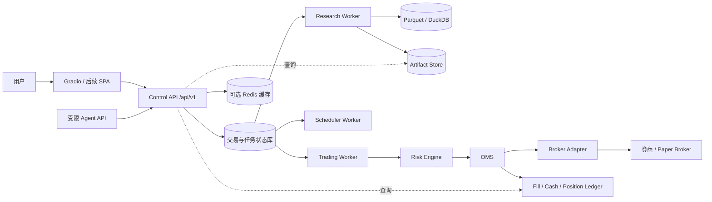
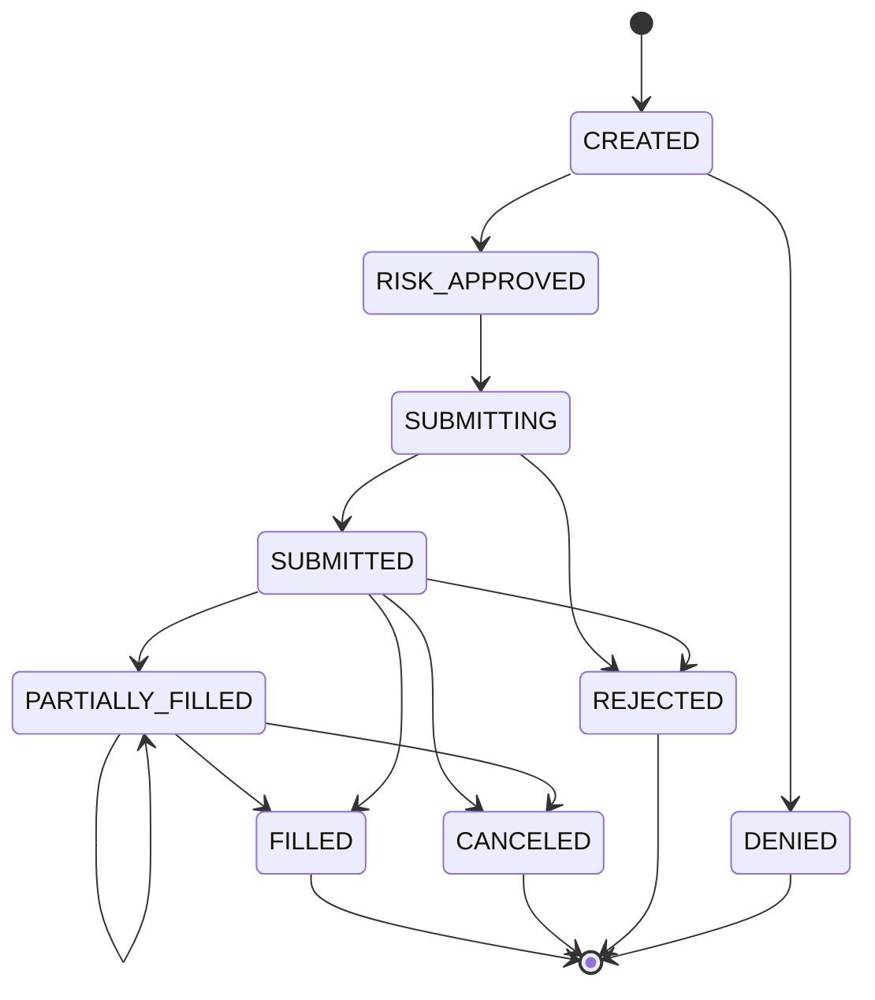

# Quart 目标架构设计 V3

> 状态：Accepted，分阶段实施
> 生效日期：2026-08-31
> 适用范围：A 股日频研究、手动 T+1 交易、模拟盘及后续券商 API 交易
> 核心决策：保留模块化单体，拆出持久化任务、交易 Worker 和统一订单账本；不整体迁移到任一开源量化框架。

## 1. 架构结论

当前项目适合作为单机、单用户、日频研究与人工交易确认平台。以下能力已经具备并应保留：

- `BarStore` 的 Parquet + DuckDB 分析存储；
- T 日收盘决策、T+1 开盘撮合；
- 回测和每日信号共用 `quart.execution.order_generator.generate_orders`；
- `ArtifactStore` 的运行制品和代码版本记录；
- SQLite 手动交易账本、计划审批、成交回填和收盘对账；
- `BrokerAdapter`、`PaperBrokerAdapter` 和券商成交回写账本的最小边界。

接入券商 API 前必须调整的根本问题：

1. 任务状态、刷新通知和模拟 Broker 仍依赖进程内内存，无法在重启或多进程下恢复；
2. 回测账户、交易计划、Broker 订单和手动账本使用不同模型，缺少统一 OMS 状态机；
3. 风控是可选钩子而不是所有订单必须经过的强制链路；
4. A 股规则按代码前缀推断，缺少按日期生效的证券主数据与规则版本；
5. 前端部分页面仍直接读取文件或领域对象，`api/` 尚不是稳定的网络 API 合同；
6. 数据指纹只记录股票数与日期边界，无法识别历史行情修订。

因此目标不是微服务化，而是形成“模块化单体 + 明确进程角色 + 单一交易状态源”。

## 2. 设计原则

### 2.1 正确性优先

- 正式研究缺少 PIT 股票池、证券状态或数据快照时必须失败；
- 交易计划不能改变账户，账户只能由成交或确认后的券商快照改变；
- 回测、模拟盘和实盘必须共享交易规则、风险规则、费用模型和订单语义；
- AI、参数扫描或人工操作均不能绕过策略准入、风控和审计。

### 2.2 状态单一来源

| 状态 | 权威来源 |
|---|---|
| 行情与因子数据 | 不可变数据快照及其清单 |
| 研究运行 | Artifact manifest + 运行索引 |
| 任务状态 | 持久化 Job/Command 表 |
| 委托与成交 | OMS 订单与执行事件表 |
| 现金与持仓 | 成交账本 + 已确认账户快照 |
| 策略准入 | 版本化 Admission Decision |
| 风控状态 | 持久化 Risk State 与限额版本 |

### 2.3 外部副作用集中

- HTTP/Gradio 请求只做校验、查询和提交命令；
- Research Worker 负责有限时长、可重试、无实盘副作用的计算任务；
- Trading Worker 是唯一允许连接券商、发单、撤单、查询回报和执行对账的进程；
- Scheduler 只提交命令，不直接执行交易逻辑；
- Redis 只能作为缓存或队列，不得成为订单、账户和任务结果的唯一来源。

## 3. 目标运行拓扑



### 3.1 当前阶段部署

- 单机运行 Gradio、Research Worker 和 Scheduler；
- SQLite 继续承载手动交易与任务状态，但开启 WAL、`busy_timeout`、schema migration 和单写者约束；
- 行情继续使用分区 Parquet + DuckDB；
- 进程之间通过持久化命令表协调，不再依赖模块级全局变量。

### 3.2 券商 API 阶段部署

- 交易状态迁移至 PostgreSQL；
- 独立 Trading Worker 持有券商会话；
- 国内券商终端通常依赖 Windows 本地 SDK，Broker Agent 可原生运行在 Windows，控制面可以容器化；
- 控制面与 Broker Agent 之间只传标准命令和执行事件，不暴露券商 SDK 类型。

## 4. 领域边界

目标依赖方向：

```text
presentation -> application -> domain <- infrastructure
```

| 领域 | 职责 | 禁止承担 |
|---|---|---|
| Market Data | 数据源适配、规范化、快照、质量门禁 | 交易决策与账户修改 |
| Research | 因子、标签、实验、WFA、模型训练、准入证据 | 券商发单 |
| Alpha Strategy | 输出预测、评分或目标暴露 | 维护真实现金与成交 |
| Portfolio | 目标权重、约束优化、换手与成本预算 | 调用券商 SDK |
| Risk | 事前检查、组合限额、交易状态机、Kill Switch | 修改研究结论 |
| OMS / Execution | 委托生命周期、幂等、重试、回报归一化 | 生成 Alpha |
| Accounting | 成交入账、现金、持仓批次、PnL、对账 | 猜测缺失成交 |
| Operations | 任务、调度、审计、指标、告警 | 放置策略算法 |

建议逐步演进的目录：

```text
quart/
├── domain/
│   ├── orders.py
│   ├── executions.py
│   ├── accounts.py
│   ├── jobs.py
│   └── events.py
├── application/
│   ├── research_service.py
│   ├── signal_service.py
│   ├── trading_service.py
│   └── reconciliation_service.py
├── market_rules/
│   ├── security_master.py
│   ├── rule_book.py
│   └── calendar.py
├── portfolio/
│   ├── constructor.py
│   ├── constraints.py
│   └── turnover.py
├── risk/
│   ├── engine.py
│   ├── limits.py
│   └── state_machine.py
├── execution/
│   ├── oms.py
│   ├── router.py
│   └── cost_model.py
├── accounting/
│   ├── ledger.py
│   ├── positions.py
│   └── pnl.py
└── infrastructure/
    ├── persistence/
    ├── jobs/
    ├── brokers/
    └── observability/
```

这是渐进目标，不要求一次搬迁已有模块。只有在当前变更能减少真实耦合时才提取新包。

## 5. 统一交易模型

### 5.1 核心对象

| 对象 | 关键字段 | 说明 |
|---|---|---|
| `SignalSnapshot` | strategy/version/as_of/scores | 某时点不可变策略输出 |
| `TargetPortfolio` | account/as_of/weights/cash_target | 组合构建结果 |
| `OrderIntent` | intent_id/account/symbol/side/qty/reason | 风控前、与券商无关的委托意图 |
| `RiskDecision` | decision/status/rules/limit_version | ALLOW/ADJUST/DENY |
| `BrokerOrder` | client_order_id/broker_order_id/status | 券商委托镜像 |
| `ExecutionReport` | event_id/order/status/filled_qty | 归一化订单回报 |
| `Fill` | fill_id/order/qty/price/fees/time | 不可重复入账的真实成交 |
| `LedgerEntry` | account/currency/debit/credit/ref | 现金与资产记账 |
| `PositionSnapshot` | account/as_of/total/sellable/cost | 查询模型，不作为成交替代品 |

所有变更对象必须具有：

- 全局唯一 ID；
- `account_id` 和环境标识 `research|paper|live`；
- 创建时间、业务时间和来源；
- 幂等键或上游唯一编号；
- 可审计的状态变化原因。

### 5.2 订单状态机



状态只能通过 `ExecutionReport` 推进。网络超时不是失败结论；必须先按 `client_order_id` 查询券商，再决定重试。

### 5.3 ARCH-001 实施状态（已完成，2026-09-01）

`quart/domain/` 已成为订单领域的无基础设施依赖合同源，提供：

- 全局 ID、环境 `research|paper|live`、带时区的创建/业务时间与幂等键；
- 不可变 `OrderIntent`、`RiskDecision`、`RiskRuleResult`、`BrokerOrder`、`ExecutionReport` 和 `Fill`；
- 只接受合法转换的状态机，订单状态只能由 `apply_execution_report()` 推进；
- `OrderPlan`、`PlannedOrderInput`、`FillInput`、`BrokerOrderRequest` 和 `BrokerFill` 到领域合同的显式转换；
- PaperBroker 对风险、提交、成交、撤单均生成标准化 `ExecutionReport`，并按 `client_order_id` / `broker_fill_id` 幂等处理重试。

该阶段不新增订单表或多进程恢复。持久化状态、事件去重索引、账本事务和故障恢复仍由 `OMS-001`、`DB-001` 与 `BROKER-001` 完成。

## 6. 持久化任务与并发模型

现有 `TaskQueue` 作为前端兼容层保留一段时间，底层改为持久化任务：

```text
job_id, family, status, params_json, resource_key,
idempotency_key, attempt, max_attempts,
created_at, claimed_at, lease_until, fencing_token,
started_at, finished_at, progress, result_run_id, error
```

任务状态：

```text
PENDING -> CLAIMED -> RUNNING -> SUCCEEDED
                           -> FAILED -> PENDING(retry)
                           -> CANCELED
```

并发规则：

1. Worker 必须先原子 claim，再执行外部副作用；
2. 同一 `resource_key` 只能由一个有效 lease 持有；
3. lease 续约必须携带 fencing token，旧 Worker 恢复后不能覆盖新 Worker；
4. 数据刷新、存储迁移和同账户交易分别串行；不同研究运行可以有限并行；
5. 重试必须返回同一业务结果或安全失败，不能产生重复订单和重复成交；
6. 日志写入持久化运行记录，前端通过轮询或 SSE 读取，不绑定 Python 回调对象。

## 7. API 与前端边界

### 7.1 Control API

新增版本化 API，Gradio 先作为同进程客户端，后续可替换为独立 SPA：

```text
GET  /api/v1/data/health
POST /api/v1/jobs
GET  /api/v1/jobs/{job_id}
GET  /api/v1/jobs/{job_id}/events
GET  /api/v1/artifacts/{run_id}
POST /api/v1/trade-plans/{plan_id}/approve
POST /api/v1/orders
POST /api/v1/orders/{order_id}/cancel
GET  /api/v1/accounts/{account_id}/positions
POST /api/v1/reconciliations
```

约束：

- mutation 请求使用 `Idempotency-Key`；
- API 返回稳定 DTO/JSON，不返回领域层 Markdown 或 pandas DataFrame；
- Markdown、表格列名和颜色由展示适配器负责；
- 路由只校验、授权、调用 application service 和映射响应；
- 前端不得直接读取 `reports/`、`data/`、SQLite 或调用 `quart.*`；
- API 合同生成 OpenAPI，并做 breaking-change 检查。

### 7.2 实时进度

- 初期采用 `GET job` 轮询；
- 日志量和并发增加后采用 SSE；
- SSE 必须实现 heartbeat、断开清理、最大连接时长和从事件序号续传；
- WebSocket 只在双向实时交互确有必要时引入。

## 8. A 股证券主数据与规则引擎

证券主数据必须按生效区间保存：

```text
symbol, exchange, board, security_type,
listed_at, delisted_at,
status, status_effective_from, status_effective_to,
lot_size, tick_size, price_limit_rule, settlement_rule
```

规则查询键：

```text
trade_date + exchange + board + security_type + status
```

必须覆盖：

- 主板、创业板、科创板、北交所；
- ST/风险警示、退市整理和状态生效日期；
- 新股上市无涨跌幅阶段；
- 停复牌、最小价位、买入整手和零股卖出；
- T+1 可卖、费用规则及历史变更；
- 后续券商订单类型与价格笼子。

回测撮合、交易计划、事前风控和券商发单前校验必须调用同一规则引擎。

## 9. 组合构建与风险引擎

策略逐步从直接返回最终权重演进为输出评分或预期收益。兼容期允许 `target_weights` 继续存在，但必须经过 Portfolio Constructor 和 Risk Engine。

第一版组合构建至少处理：

- 单票和行业上限；
- 目标持仓数与现金缓冲；
- 排名缓冲和最小调仓偏离；
- 单日换手与费用预算；
- ADV 参与率与最低成交额；
- 停牌、跌停和 T+1 不可卖导致的残余持仓。

风险状态：

```text
ACTIVE    正常接受增减仓
REDUCING  只允许降低风险
HALTED    禁止新增和修改订单，允许撤单与查询
RECOVERY  对账、数据和人工复核后才能恢复
```

正式信号和实盘订单不能关闭 Risk Engine。风险决策必须保存规则版本、输入、调整结果和原因。

## 10. 数据快照与研究可复现

`ArtifactStore` 保留，但数据版本升级为快照清单：

```text
snapshot_id
dataset_name / schema_version
partition -> size / row_count / min_date / max_date / content_hash
universe_snapshot_id
security_master_version
corporate_action_version
rule_book_version
created_at / source / quality_status
```

研究运行指纹至少包含：

- Git commit 和工作树是否 dirty；
- 完整配置哈希和显式参数；
- 数据快照、股票池、证券主数据和规则版本；
- 因子、标签、模型和随机种子版本；
- Python 与关键依赖版本。

只记录股票数量和首尾日期不能视为可复现数据版本。

## 11. Broker Adapter 目标契约

在现有最小接口上补充：

- 连接、断线、重连和健康状态；
- 查询账户、现金、持仓、活动订单和历史成交；
- 提交、撤销、查询订单，支持稳定 `client_order_id`；
- 订单和成交回调或轮询游标；
- 券商错误码到标准错误分类的映射；
- 交易日、时区、精度、数量和价格规则能力声明；
- 启动时订单恢复与收盘账户对账。

优先路径：

1. PaperBroker 验证 OMS 与重启恢复；
2. 手动成交导入继续使用同一 `FillService`；
3. 若目标券商受 vn.py Gateway 支持，编写 vn.py 适配层；
4. MiniQMT/xtquant 等 Windows SDK 作为独立 Broker Agent；
5. 小资金、单账户、限价单灰度，稳定后再扩展订单类型。

## 12. AI 与自动研究边界

借鉴 QuantDinger 的 Human API/Agent API 隔离，但 AI 在本项目中的定位是研究助手，不是收益保证或自主操盘者。

允许：

- 查询只读行情、因子、制品和研究状态；
- 提交有资源上限的回测、因子审计和模拟盘任务；
- 生成策略草案、参数建议和解释报告；
- 提议准入变更，等待人工复核。

禁止：

- 读取券商密钥、账户凭据或管理员令牌；
- 直接修改正式策略白名单和风险限额；
- 未经沙箱执行生成的 Python；
- 默认发起实盘订单。

生成代码运行环境必须限制网络、文件系统、CPU、内存和超时，并使用只读数据快照。Agent token 需要 scope、限流、审计；交易 scope 默认只允许 paper。

## 13. 安全、审计与可观测性

### 13.1 安全

- 本地模式仍默认监听 `127.0.0.1`；
- 网络 API 使用用户身份、RBAC 和 CSRF/来源校验；
- 券商凭据加密保存，日志、Artifact 和异常不得输出明文；
- `research|paper|live` 环境在 UI、订单、日志和数据库中明确区分；
- 高风险操作要求二次确认和可追溯操作者；
- Kill Switch 独立于策略进程，可禁止新增订单但保留撤单与查询。

### 13.2 可观测性

结构化日志字段至少包含：

```text
trace_id, job_id, run_id, account_id,
plan_id, order_id, broker_order_id, strategy, environment
```

核心指标：

- 数据新鲜度、股票池覆盖率、质量阻断数；
- Job 排队时长、运行时长、失败率和重试次数；
- 信号生成成功率与制品落地时间；
- 委托拒绝率、成交率、部分成交、滑点和费用偏差；
- 账户对账差异、持仓偏差和未解决订单数；
- 风控拒绝、状态切换和 Kill Switch 状态。

## 14. 开源系统借鉴边界

| 项目 | 借鉴内容 | 使用边界 |
|---|---|---|
| [QuantDinger](https://github.com/OpenByteInc/QuantDinger) | 进程角色、持久化命令、租约/幂等、Agent API、安全和可观测性 | 后端 Apache-2.0；前端为独立 source-available 许可，不复制 UI 源码 |
| [vn.py](https://github.com/vnpy/vnpy) | EventEngine、Gateway、订单成交事件、风险和 A 股券商适配 | 作为南向交易适配，不替换日频研究内核 |
| [Qlib](https://github.com/microsoft/qlib) | Dataset/Handler、实验记录、滚动训练、模型工作流 | 只进入研究域，不承担 OMS 和账户账本 |
| [RQAlpha](https://github.com/ricequant/rqalpha) | Mod Hook、账户/风险/费用/模拟/分析器解耦 | 其仓库声明仅限非商业使用，只借鉴设计 |
| [WonderTrader](https://github.com/wondertrader/wondertrader) | 理论持仓、目标仓位合并、多账户和运行监控 | 日频阶段不引入 C++ 高频内核 |
| [NautilusTrader](https://github.com/nautechsystems/nautilus_trader) | 确定性时钟、订单事件、RiskEngine、回测实盘语义一致 | 作为领域语义参考，不直接替换 A 股实现 |

## 15. 分阶段迁移

### Phase A：单机可信控制面

- 建立 migration、WAL、`busy_timeout` 和数据库版本；
- 定义统一领域 ID、订单/执行事件和环境标识；
- 建立持久化 Job 表，前端任务改为提交/查询模式；
- 清除前端直读 `quart/`、`reports/` 和 SQLite；
- 数据快照增加内容哈希；
- 保持手动 T+1 主流程不变。

验收：应用重启后任务和交易状态可恢复；重复请求不产生重复任务或成交。

### Phase B：组合、规则和风控统一

- 建立 SecurityMaster 与按日期版本化 RuleBook；
- 增加 Portfolio Constructor；
- Risk Engine 变为强制链路；
- 回测、信号、PaperBroker 使用同一规则与风险决策；
- 完成规则、风险和组合约束的属性测试。

验收：同一账户、日期和订单在回测与模拟盘得到一致合法性结论。

### Phase C：持久化 OMS 与模拟盘

- 实现订单状态机、执行事件、恢复和对账；
- PaperBroker 持久化并支持重启恢复；
- Trading Worker 独立运行，拥有唯一券商副作用权限；
- 补齐结构化日志、指标和告警。

验收：故障注入、重复回报和 Worker 重启不造成重复订单或重复成交。

### Phase D：券商灰度接入

- 迁移交易状态至 PostgreSQL；
- 接入一个券商 Adapter/Broker Agent；
- 先查询和对账，再模拟报单，最后小资金实盘；
- 默认单账户、限价单、人工审批和严格限额。

验收：连续模拟盘通过，账户、订单和成交无未解决差异，Kill Switch 与恢复流程演练通过。

### Phase E：多用户与 AI 控制面

- 独立 Web API/SPA、RBAC 和审计查询；
- 有界 Research Worker 池和可选 Redis/Celery；
- 只读/模拟盘 Agent Gateway；
- 模型、因子和策略漂移监控。

## 16. 明确不做

- 不为追求“商业级”标签提前拆成大量微服务；
- 不因接入开源项目而重写已验证的日频回测内核；
- 不在缺少 PIT 数据和规则版本时扩张策略数量；
- 不让前端、调度器或 AI 绕过 Application Service 直接修改账户；
- 不在模拟盘和故障恢复验收前开放自动实盘；
- 不把高额稳定收益作为软件架构验收条件。

## 17. 完成定义

架构阶段任务只有同时满足以下条件才算完成：

1. 领域状态、所有者、幂等策略和失败恢复已明确；
2. 代码、数据库迁移、API 合同、测试和文档在同一变更中更新；
3. 回测/模拟/实盘共享规则与风险的证据可由自动化测试复现；
4. 重启、超时、重复请求、重复回报和部分失败路径有测试；
5. 没有把规划能力描述成已经上线的能力；
6. 不改变策略准入或正式信号参数，除非有独立样本外研究证据。
